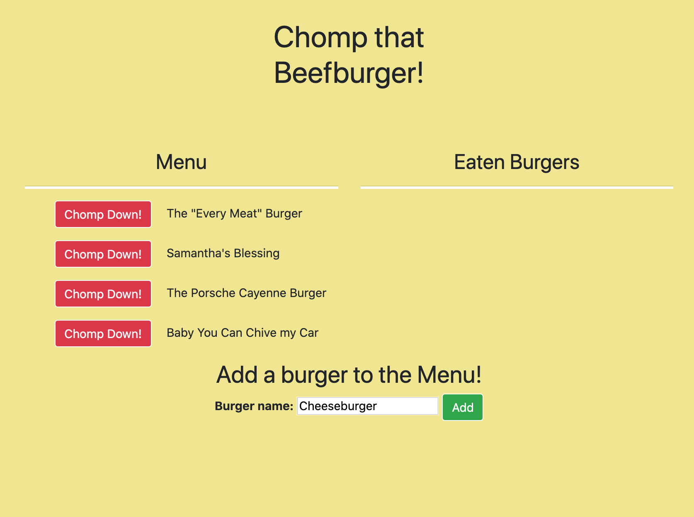

# chompThatBeefburger

### Link to the deployed site

https://seanianking.github.io/Dayinthelife/

## Contents

Below is a picture of the landing page:

By clicking the Chomp Down! button it updates the boolean in the database 'Chomped' from false to true, and shifts the burger to the eaten column.

Pressing the delete button removes the burger from the database and the page. You can add a new burger to the menu via the input and add button at the bottom of the page. This will insert a new line into the database.

